# Gifcards — System Architecture

> **Version:** 1.2  
> **Role:** Senior Solutions Architect  
> **Related:** [design.md](./design.md) (screen-level specs, user flows)  
> **Default language:** English (EN/ES supported)

---

## 1. Executive Summary

Gifcards is a B2B2C platform that enables merchants in Ecuador to create, sell, and manage digital gift cards without building their own technical infrastructure. Merchants configure branded gift card products in minutes; end customers purchase online and redeem in physical or digital stores via QR code or alphanumeric code. The platform provides centralized tracking, partial-balance redemption, and sales analytics.

The target architecture is **multi-tenant**, **mobile-first**, and **guest-checkout friendly**: buyers are not required to create accounts to complete a purchase. Merchants authenticate via Firebase Auth; sensitive operations (payments, redemption, code generation) run server-side on Cloudflare Workers with Firestore as the system of record. The approved startup stack is documented in **§2 Technology Stack** (React/TypeScript, Chakra UI, Vercel, Workers, Firebase, AWS S3, Stripe, Beely, Amplitude, Sentry, Gemini phased).

### Architecture Principles

1. **Tenant isolation first** — Every data path is scoped by `merchantId`; public access uses opaque tokens only.
2. **Server-authoritative money paths** — Purchases and redemptions are finalized only via Workers (webhooks or authenticated API), never client-only writes.
3. **Immutable ledger** — `transactions` are append-only; balance changes derive from ledger entries.
4. **Phased delivery** — Phase 1 ships the revenue loop (create → sell → redeem → dashboard); Phases 2–3 add staff, campaigns, WhatsApp, exports, platform admin, and AI.
5. **Edge-native, stateless API** — Cloudflare Workers scale horizontally; no sticky sessions.
6. **Product without AI** — Gemini is an optional enhancement behind feature flags, not a runtime dependency.

---

## 2. Technology Stack

Official stack for Gifcards. Each layer includes rationale, alternatives, cost, and scalability. **CI/CD and IaC are out of scope** for this document (team choice at implementation time).

### 2.1 Stack Overview

| Layer | Technology | Phase |
|-------|------------|-------|
| Frontend framework | React + TypeScript + Vite | 1 |
| UI components | **Chakra UI** | 1 |
| Web hosting | **Vercel** | 1 |
| API | Cloudflare Workers (Hono recommended) | 1 |
| Database | Firestore | 1 |
| Authentication | Firebase Auth | 1 |
| File storage | **AWS S3** | 1 |
| Payments | Stripe Connect | 1 |
| Email | Beely | 1 |
| Product analytics | Amplitude | 1 |
| Error monitoring | Sentry | 1 |
| AI (optional) | Google Gemini | 3 |
| Shared validation | Zod + shared types package | 1 |

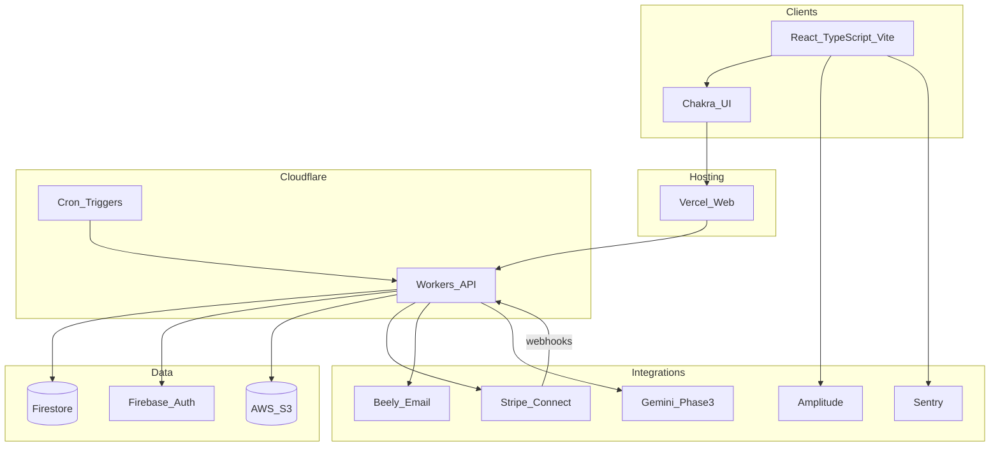

> **Production diagram:** See **§7.0 Production Architecture Diagram** for actors, trust boundaries, layer legend, and request-path sequence.

### 2.2 Frontend — React + TypeScript + Vite

| | |
|---|---|
| **Why** | Single SPA for landing, merchant app, storefront, and redeem UI. TypeScript aligns API contracts with Workers. Vite gives fast HMR and lean production bundles for mobile-first users in Ecuador. |
| **Alternatives** | **Next.js** — stronger SEO/SSR for marketing; more complexity for dashboard-heavy product. **Remix** — great data loading; tighter hosting coupling. |
| **Cost** | Build tooling is free; cost is engineering time. Vercel hosts the output (see §2.3). |
| **Scalability** | Static/client bundles scale via CDN. Code-split routes (merchant vs customer) to protect first paint at 100k users. |

### 2.3 UI — Chakra UI

| | |
|---|---|
| **Why** | Accessible components out of the box (forms, modals, toasts) speed MVP delivery. Theming API supports **merchant white-label** storefronts (primary/secondary colors from `merchants`). Strong React ecosystem fit; works well with Vite. |
| **Alternatives** | **shadcn/ui + Tailwind** — more customizable, slower initial layout. **MUI** — heavier bundle. **Radix + custom CSS** — maximum control, more build time. |
| **Cost** | Open source (MIT); no license fees. Slightly larger bundle than headless-only libs — mitigate with route-level code splitting. |
| **Scalability** | Component library does not limit scale. Define a thin **design token layer** (Gifcards platform theme vs merchant storefront theme) early to avoid one-off overrides. |

### 2.4 Web Hosting — Vercel

| | |
|---|---|
| **Why** | Optimized for React/Vite SPAs: preview deployments per branch, edge network, simple env vars for `VITE_*` API URLs. Decouples **web** from **API** (Workers) while keeping merchant/customer deploys fast. |
| **Alternatives** | **Cloudflare Pages** — tighter coupling with Workers; single vendor. **Netlify** — similar to Vercel. **AWS Amplify** — more AWS surface area. |
| **Cost** | Hobby/free tier for early stage; **Pro ~$20/user/mo** for team features. Bandwidth usually negligible pre-PMF; monitor if landing goes viral. |
| **Scalability** | Global CDN; automatic scaling for static assets. Configure **rewrites** to Workers API origin; no server to manage. Revalidation not required for SPA shell. |

### 2.5 API — Cloudflare Workers

| | |
|---|---|
| **Why** | Server-authoritative paths (Stripe webhooks, mint `issuedCard`, atomic redemption, S3 presigns). Low latency worldwide, no containers, pairs with stateless Firestore access via Admin SDK. |
| **Alternatives** | **AWS Lambda + API Gateway** — mature; colder starts and more IAM overhead. **Firebase Cloud Functions** — simpler Firebase coupling; less flexible for Stripe + S3. **Node service on Fly/Railway** — easier local dev; you manage scaling and patching. |
| **Cost** | Generous free tier; paid usage typically **$0–50/mo** pre-PMF, grows with request volume. Cheaper than always-on VMs at low/medium traffic. |
| **Scalability** | Horizontal by default. Use **Cron Triggers** for `merchantStats` rollups; **Queues** for email retries and exports. Respect CPU limits — offload heavy QR batch jobs. |

### 2.6 Database — Firestore

| | |
|---|---|
| **Why** | Document model maps to `merchants`, `giftCards`, `issuedCards`, `transactions`. Optional real-time listeners for balance UI. Well-supported from Workers with Admin SDK. |
| **Alternatives** | **PostgreSQL (Supabase/Neon)** — better ad-hoc reporting and exports; requires schema migration from current architecture. **DynamoDB** — scales massively; steeper modeling. |
| **Cost** | Pay per read/write/storage. Early: **$0–100/mo**; at 100k users can reach **$400+/mo** if dashboards scan raw `transactions` — use rollups (§8.4). |
| **Scalability** | Proven to 100k+ users with composite indexes (`code`, `slug`, `merchantId+createdAt`). Plan BigQuery export (Phase 3) before analytics overload Firestore. |

### 2.7 Authentication — Firebase Auth

| | |
|---|---|
| **Why** | Email/password + Google for merchants; custom claims for `platform_admin`; magic-link wallet (Phase 2). Mature SDKs for web. |
| **Alternatives** | **Clerk** — faster org/invite UX; per-MAU pricing. **Auth0** — enterprise; heavy for startup. **Custom JWT** — full control; you own security incidents. |
| **Cost** | Typically **free or negligible** vs payment fees. |
| **Scalability** | Scales to millions of identities; authorization still enforced in Workers + `merchantMembers`. |

### 2.8 File Storage — AWS S3

| | |
|---|---|
| **Why** | PRD-mandated durable storage for logos, gift card previews, cached QR PNGs, and ephemeral CSV exports. Presigned PUT from Workers keeps buckets private; public assets via CloudFront or signed URLs. |
| **Alternatives** | **Cloudflare R2** — zero egress to Workers; different vendor than PRD. **Firebase Storage** — simpler with client SDK; weaker presign-only write pattern. |
| **Cost** | Storage ~**$0.023/GB-mo**; requests pennies. **Egress** to Vercel/users is the main variable — use **CloudFront** in front of public prefixes or serve via signed URLs with long TTL for logos. Exports: 24h lifecycle rule. Early total often **&lt;$10/mo**. |
| **Scalability** | Unlimited objects; no practical cap for 100k users. Generate QR once per `issuedCard`, store in S3, reuse URL. |

### 2.9 Payments — Stripe Connect

| | |
|---|---|
| **Why** | Marketplace payouts to merchants, hosted Checkout/Elements minimizes card-data scope, webhooks drive idempotent `issuedCard` creation. |
| **Alternatives** | **Mercado Pago** — local methods in Ecuador; weaker multi-merchant Connect model. **Manual bank transfer** — operational burden (PRD “cash” flow). |
| **Cost** | **~2.9% + fixed** per successful charge (region-dependent); dominates unit economics vs infra. |
| **Scalability** | Stripe scales TPV; bottleneck is webhook idempotency and Worker processing, not Stripe itself. |

### 2.10 Email — Beely

| | |
|---|---|
| **Why** | PRD choice for transactional gift-card delivery, password reset remains on Firebase Auth, optional redemption receipts in Phase 2. |
| **Alternatives** | **Resend**, **Postmark**, **SendGrid** — similar transactional APIs; evaluate if Beely lacks templates or Ecuador deliverability data. |
| **Cost** | Startup tiers often **$0–20/mo** until high volume. |
| **Scalability** | Provider-managed; queue retries from Workers if rate-limited. Never roll back payment on email failure. |

### 2.11 Product Analytics — Amplitude

| | |
|---|---|
| **Why** | PRD success metrics (80% session completion, &lt;2 min creation, 40% retention) need funnels and cohorts. |
| **Alternatives** | **PostHog** — analytics + flags + replay in one product. **Mixpanel** — comparable to Amplitude. |
| **Cost** | Free startup tier; paid can reach **$100–500+/mo** as event volume grows. Instrument ~15 core events, not every click. |
| **Scalability** | Fully managed; add server-side `purchase_completed` from webhook handler for truth. |

### 2.12 Observability — Sentry

| | |
|---|---|
| **Why** | Unified errors for React (Vercel) and Workers on money paths (webhooks, redemption). Supports exception capture required for production debugging. |
| **Alternatives** | **Datadog** — powerful, expensive pre-PMF. **Cloudflare observability only** — misses frontend context. |
| **Cost** | Free tier often sufficient early; **~$26–80/mo** as events grow. |
| **Scalability** | Use sampling and environment tags (`production`, `preview`); never log full gift codes in breadcrumbs. |

### 2.13 AI — Google Gemini (Phase 3)

| | |
|---|---|
| **Why** | Copy/design suggestions and admin dispute summaries; non-critical path behind feature flags (§11). |
| **Alternatives** | **OpenAI API** — strong general models; second vendor. **No AI** — zero cost until PMF. |
| **Cost** | Near **$0** with rate limits; unbounded if every wizard keystroke calls the API. |
| **Scalability** | Stateless HTTP from Workers; timeouts and empty fallbacks required. |

### 2.14 Rough Monthly Cost (Infrastructure Only)

Excludes Stripe transaction fees and team salaries.

| Stage | Approx. infra/mo | Main drivers |
|-------|------------------|--------------|
| Pre-PMF (&lt;500 merchants) | **$0–75** | Vercel Hobby, CF Workers free tier, Firebase/Amplitude/Sentry free tiers, minimal S3 |
| Growth (5k–20k users) | **$75–400** | Firestore reads, Vercel Pro, S3 egress, email volume |
| Target (100k users) | **$400–1,500+** | Firestore access patterns, Amplitude events, S3+CloudFront |

### 2.15 Deferred / Out of Scope

| Topic | Note |
|-------|------|
| **CI/CD** | Not specified here; typical choice is GitHub Actions or Vercel Git integration. |
| **IaC** | Not specified here; Workers via Wrangler; AWS via console or Terraform when needed. |
| **Kubernetes / microservices** | Not justified before large engineering team. |

---

## 3. Phased Rollout Matrix

Capabilities are mapped to release phases. Screen IDs refer to [design.md](./design.md).

| Capability | Phase | Notes |
|------------|-------|-------|
| Public landing, merchant signup/login (email, Google) | **1** | L1, M1–M4 |
| Merchant onboarding (profile, slug, branding) | **1** | S3 presigned logo upload |
| Create/publish gift cards (fixed + variable value) | **1** | M6; target &lt; 2 min creation |
| Storefront, checkout, Stripe payment | **1** | C1–C5; Stripe Connect onboarding may be P2 (M16) for first merchants |
| Issue `issuedCard`, email delivery (Beely) | **1** | Webhook-idempotent mint |
| Gift card view by token, QR fullscreen | **1** | C6, C9 |
| Redemption (merchant “redeem mode”, QR + manual code) | **1** | M12–M13 (Staff UI deferred) |
| Dashboard KPIs, transaction list | **1** | M5, M11; rollups or live queries |
| i18n EN (default) + ES | **1** | Browser detect + manual toggle |
| Customer wallet (magic link by email) | **2** | C7–C8 |
| Stripe Connect settings UI | **2** | M16 |
| Analytics charts, edit gift card | **2** | M9, M10 |
| Staff accounts (invite, redeem-only RBAC) | **2** | Dedicated staff routes |
| Campaigns (group gift cards, filter analytics) | **2** | PRD merchant feature |
| WhatsApp delivery | **2** | PRD Flow 2; email sufficient in Phase 1 |
| CSV/Excel export | **2** | PRD merchant feature |
| Configurable expiration on gift cards | **2** | Optional in PRD |
| Platform admin console | **3** | Merchant management, disputes, global config |
| Anti-fraud (velocity, duplicate redeem) | **3** | Rules engine; Gemini advisory optional |
| Gemini (copy, design suggestions) | **3** | Feature-flagged |
| Marketplace (multi-merchant discovery) | **3+** | Out of initial scope; per-storefront URLs in Phase 1 |
| Cash / manual issuance | **3+** or out of scope | PRD Flow 2 mentions cash; stack is Stripe-only |

---

## 4. User Types & RBAC

### 4.1 Roles

| Role | Description | Auth mechanism | Phase |
|------|-------------|----------------|-------|
| **Prospect** | Visitor on public landing | None | 1 |
| **Merchant (owner)** | Business owner; full merchant app | Firebase Auth (email/password, Google) | 1 |
| **Merchant staff** | In-store redemption, limited visibility | Firebase Auth + `merchantMembers` record | 2 |
| **Customer (buyer)** | Purchases gift cards | Guest email at checkout; optional wallet | 1 |
| **Customer (redeemer)** | Views balance, presents QR | Unguessable URL token `/gift/:token` | 1 |
| **Platform admin** | Platform operations, disputes | Firebase Auth + custom claim `platform_admin` | 3 |

### 4.2 Role Hierarchy

```
platform_admin > merchant_owner > merchant_staff > public_token_scoped
```

### 4.3 Permission Matrix (Target)

| Resource / Action | Owner | Staff | Customer | Admin |
|-------------------|:-----:|:-----:|:--------:|:-----:|
| Manage merchant profile & settings | ✓ | — | — | ✓ (read/suspend) |
| Connect Stripe / view payouts | ✓ | — | — | ✓ (support) |
| Create/edit/pause gift card products | ✓ | — | — | ✓ (read) |
| View all merchant transactions | ✓ | ✓ | — | ✓ |
| Redeem issued cards | ✓ | ✓ | — | — |
| Invite/remove staff | ✓ | — | — | — |
| Purchase on storefront | — | — | ✓ (guest) | — |
| View own issued card by token | — | — | ✓ | — |
| Wallet: list cards by email | — | — | ✓ (magic link) | — |
| Platform config & disputes | — | — | — | ✓ |

**Phase 1 note:** Staff permissions are satisfied by the merchant owner using Redeem mode (M12–M13). Phase 2 introduces `merchantMembers` and separate staff login.

### 4.4 User Type Diagram

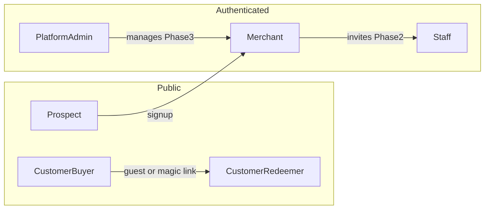

---

## 5. Domain Model

### 5.1 Entity Overview

| Collection | Purpose |
|------------|---------|
| `merchants` | Tenant profile, branding, Stripe Connect state |
| `merchantMembers` | Staff ↔ merchant mapping (Phase 2) |
| `giftCards` | Sellable product template |
| `campaigns` | Promotional grouping (Phase 2) |
| `issuedCards` | Purchased instance with balance and unique code |
| `transactions` | Immutable financial ledger |
| `paymentSessions` | Stripe checkout lifecycle / idempotency |
| `merchantStats` | Materialized KPI rollups (optional, recommended at scale) |
| `disputes` | Platform support cases (Phase 3) |
| `platformConfig` | Global settings singleton (Phase 3) |
| `webhookEvents` | Processed Stripe event IDs (idempotency) |

Firebase Auth holds `users` (identities); Firestore `merchants` typically uses `merchantId === owner uid` in Phase 1.

### 5.2 ER Diagram

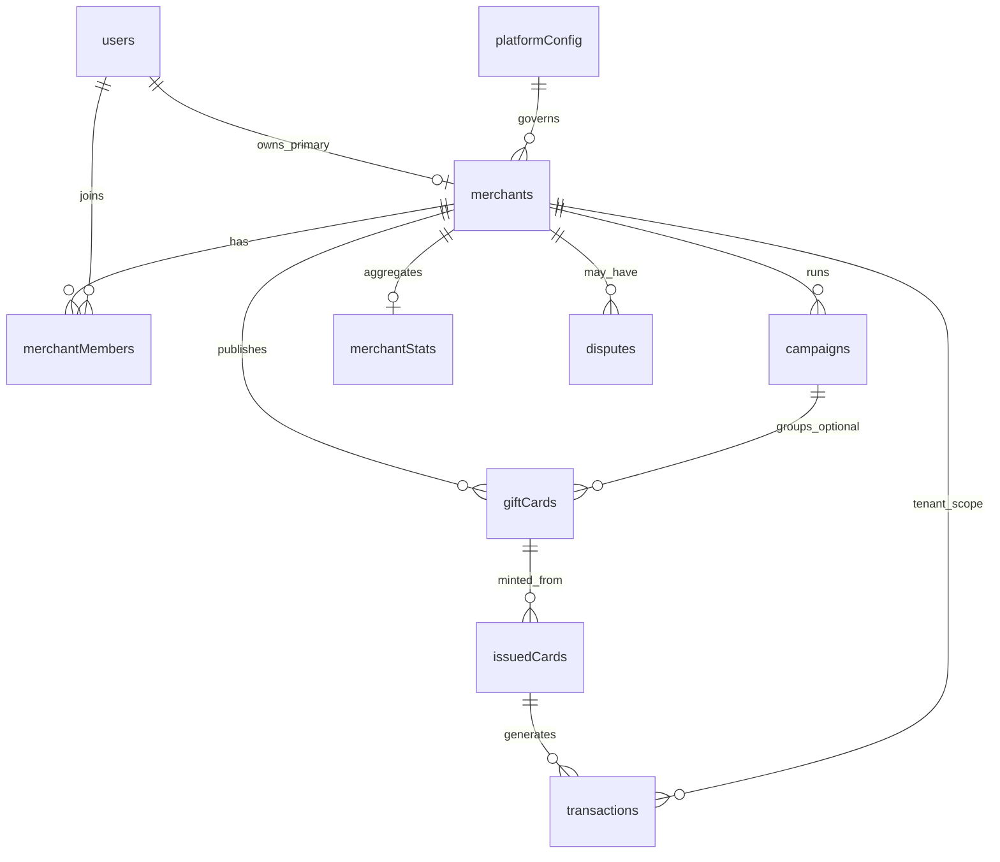

### 5.3 Integrity Rules

- `issuedCards.balance` ≥ 0 at all times; never updated without a corresponding `transactions` row.
- Redemptions use a **Firestore transaction** (or single Worker-orchestrated atomic write): read balance → validate → decrement → insert transaction.
- `giftCards.status` ∈ `draft | active | paused | archived` — only `active` cards appear on storefront.
- `issuedCards.status` ∈ `active | partially_redeemed | redeemed | expired | void`.
- **Unique:** `merchants.slug`, `issuedCards.code` (and `issuedCards.token` for URL access).
- **Multi-tenancy:** All merchant queries include `merchantId`; staff queries validate `merchantMembers`.
- **Immutability:** `giftCards` value fields should not change after sales &gt; 0 (enforced in API).

### 5.4 Schema Tables

#### `merchants/{merchantId}`

| Field | Type | Required | Description |
|-------|------|----------|-------------|
| `id` | string | ✓ | Same as owner `uid` in Phase 1 |
| `slug` | string | ✓ | Unique URL segment, e.g. `cafe-luna` |
| `businessName` | string | ✓ | Display name |
| `logoUrl` | string | | S3 URL |
| `primaryColor` | string | | Hex, white-label |
| `secondaryColor` | string | | Hex |
| `contactEmail` | string | | |
| `contactPhone` | string | | |
| `preferredLanguage` | string | | `en` \| `es` |
| `onboardingCompleted` | boolean | ✓ | |
| `stripeAccountId` | string | | Stripe Connect account |
| `stripeOnboardingComplete` | boolean | | |
| `payoutsEnabled` | boolean | | |
| `requirementsDue` | string[] | | From Stripe |
| `status` | string | | `active` \| `suspended` (admin, Phase 3) |
| `ownerUserId` | string | ✓ | Firebase Auth uid |
| `createdAt` | timestamp | ✓ | |
| `updatedAt` | timestamp | ✓ | |

#### `merchantMembers/{id}` (Phase 2)

| Field | Type | Required | Description |
|-------|------|----------|-------------|
| `id` | string | ✓ | Document ID |
| `merchantId` | string | ✓ | |
| `userId` | string | ✓ | Firebase Auth uid |
| `role` | string | ✓ | `staff` (extendable) |
| `invitedBy` | string | | Owner uid |
| `invitedAt` | timestamp | | |
| `acceptedAt` | timestamp | | |

#### `giftCards/{cardId}`

| Field | Type | Required | Description |
|-------|------|----------|-------------|
| `id` | string | ✓ | |
| `merchantId` | string | ✓ | |
| `campaignId` | string | | Phase 2 optional |
| `name` | string | ✓ | |
| `valueType` | string | ✓ | `fixed` \| `variable` |
| `fixedAmount` | number | | Cents or decimal per convention |
| `minAmount` | number | | |
| `maxAmount` | number | | |
| `currency` | string | ✓ | Default `USD` |
| `message` | string | | Customer-facing message |
| `designOverrides` | map | | Optional overrides of merchant branding |
| `previewImageUrl` | string | | S3 |
| `status` | string | ✓ | `draft` \| `active` \| `paused` \| `archived` |
| `publicUrl` | string | | Generated storefront path |
| `qrCodeUrl` | string | | Product-level QR asset (optional) |
| `expiresAfterDays` | number | | Phase 2; applied to new issuances |
| `salesCount` | number | | Denormalized counter |
| `totalRevenue` | number | | Denormalized |
| `createdAt` | timestamp | ✓ | |
| `updatedAt` | timestamp | ✓ | |

#### `issuedCards/{issuedCardId}`

| Field | Type | Required | Description |
|-------|------|----------|-------------|
| `id` | string | ✓ | |
| `token` | string | ✓ | Opaque URL token (high entropy) |
| `code` | string | ✓ | Human/scan code (unique, indexed) |
| `giftCardId` | string | ✓ | |
| `merchantId` | string | ✓ | |
| `balance` | number | ✓ | Current balance |
| `initialAmount` | number | ✓ | |
| `currency` | string | ✓ | |
| `status` | string | ✓ | See integrity rules |
| `ownerEmail` | string | | Buyer email |
| `recipientEmail` | string | | Gift recipient |
| `qrPayload` | string | | Encoded payload for QR |
| `expiresAt` | timestamp | | Phase 2 |
| `stripePaymentIntentId` | string | | |
| `paymentSessionId` | string | | |
| `createdAt` | timestamp | ✓ | |
| `updatedAt` | timestamp | ✓ | |

#### `transactions/{transactionId}`

| Field | Type | Required | Description |
|-------|------|----------|-------------|
| `id` | string | ✓ | |
| `type` | string | ✓ | `purchase` \| `redemption` \| `refund` \| `adjustment` |
| `amount` | number | ✓ | Positive; sign implied by type |
| `merchantId` | string | ✓ | |
| `giftCardId` | string | | |
| `issuedCardId` | string | | |
| `customerEmail` | string | | |
| `code` | string | | Denormalized for support |
| `status` | string | ✓ | `completed` \| `failed` \| `pending` |
| `stripeEventId` | string | | Idempotency for purchases |
| `performedByUserId` | string | | Staff/owner on redemption |
| `notes` | string | | Redemption notes |
| `createdAt` | timestamp | ✓ | |

#### `paymentSessions/{sessionId}`

| Field | Type | Required | Description |
|-------|------|----------|-------------|
| `id` | string | ✓ | |
| `stripeSessionId` | string | ✓ | |
| `merchantId` | string | ✓ | |
| `giftCardId` | string | ✓ | |
| `amount` | number | ✓ | |
| `buyerEmail` | string | ✓ | |
| `recipientEmail` | string | | |
| `giftMessage` | string | | |
| `status` | string | ✓ | `pending` \| `completed` \| `expired` \| `failed` |
| `issuedCardId` | string | | Set on success |
| `createdAt` | timestamp | ✓ | |

#### `campaigns/{campaignId}` (Phase 2)

| Field | Type | Required | Description |
|-------|------|----------|-------------|
| `id` | string | ✓ | |
| `merchantId` | string | ✓ | |
| `name` | string | ✓ | e.g. Navidad 2026 |
| `startAt` | timestamp | | |
| `endAt` | timestamp | | |
| `status` | string | ✓ | `active` \| `ended` |

#### `merchantStats/{merchantId}` (optional rollup)

| Field | Type | Description |
|-------|------|-------------|
| `totalSales` | number | Lifetime or windowed |
| `totalRedemptions` | number | |
| `outstandingBalance` | number | Sum of active issued balances |
| `period` | string | e.g. `30d` |
| `updatedAt` | timestamp | |

#### `disputes/{disputeId}` (Phase 3)

| Field | Type | Description |
|-------|------|-------------|
| `merchantId` | string | |
| `transactionId` | string | |
| `issuedCardId` | string | |
| `status` | string | `open` \| `resolved` |
| `description` | string | |
| `createdAt` | timestamp | |

#### `platformConfig/default` (Phase 3)

| Field | Type | Description |
|-------|------|-------------|
| `platformFeePercent` | number | |
| `maintenanceMode` | boolean | |
| `featureFlags` | map | e.g. `geminiEnabled` |

#### `webhookEvents/{stripeEventId}`

| Field | Type | Description |
|-------|------|-------------|
| `processedAt` | timestamp | Idempotency record |
| `type` | string | Stripe event type |

---

## 6. Business Workflows

### 6.1 Merchant Onboarding

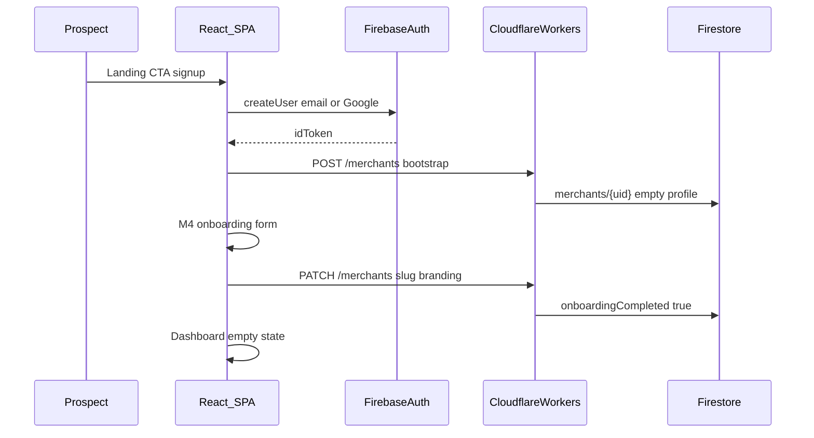

### 6.2 Purchase Flow

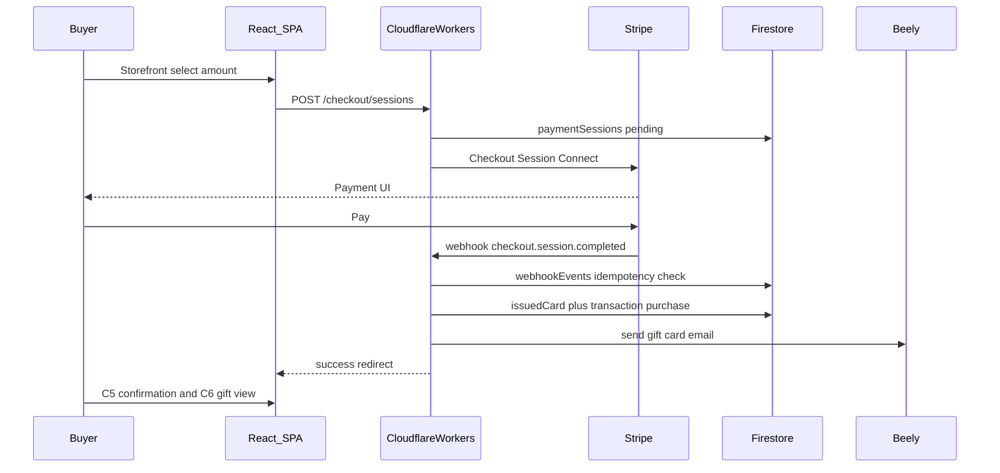

### 6.3 Redemption Flow

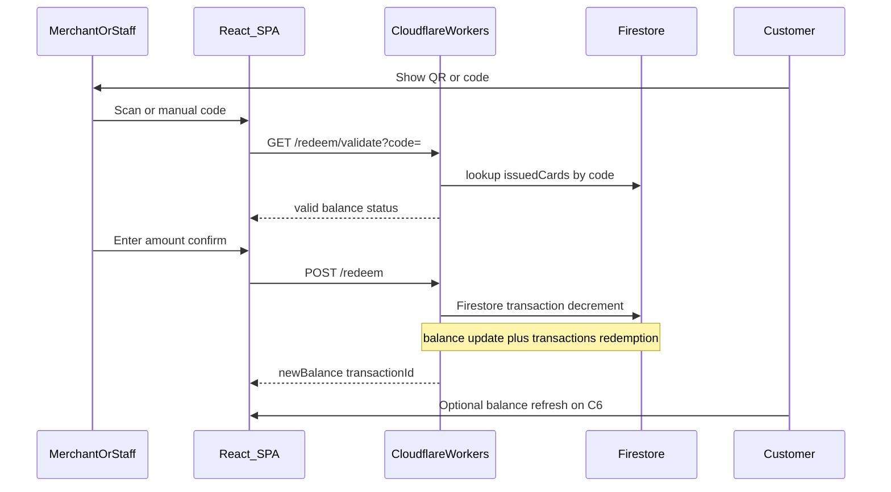

### 6.4 Stripe Webhook Processing

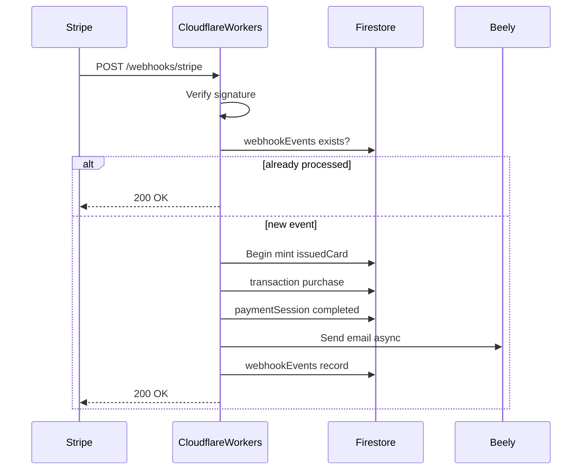

### 6.5 Staff Invite (Phase 2)

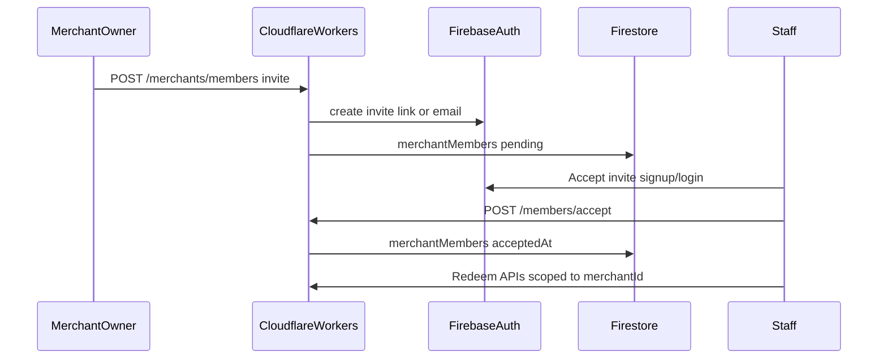

### 6.6 Platform Admin Dispute (Phase 3)

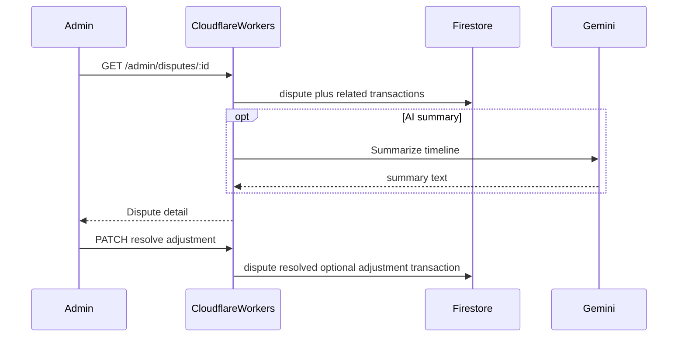

---

## 7. System Context

### 7.0 Production Architecture Diagram

High-level **production** topology for Gifcards. All write paths for money and balances go through the **Backend**; the **Frontend** never mutates Firestore directly for purchases or redemptions.

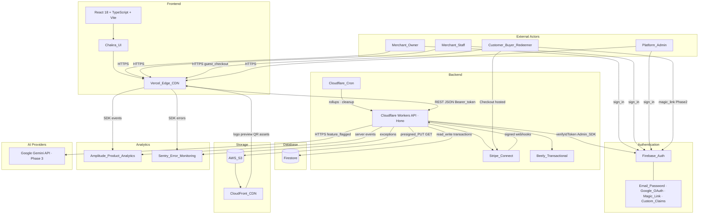

#### Request paths (summary)

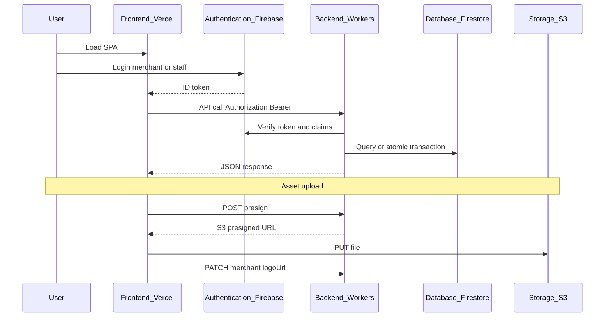

#### Component legend

| Layer | Components | Responsibility | Protocols |
|-------|------------|----------------|-----------|
| **Frontend** | React, TypeScript, Vite, Chakra UI, Vercel | Landing, merchant app, storefront, checkout UI, redeem scanner, gift card view | HTTPS, static CDN |
| **Backend** | Cloudflare Workers (Hono), Cron, Stripe Connect, Beely | REST API, webhooks, atomic redemption, checkout sessions, email triggers, S3 presigns | HTTPS, Stripe signatures |
| **Database** | Firestore | `merchants`, `giftCards`, `issuedCards`, `transactions`, `paymentSessions`, rollups | Firebase Admin SDK from Workers only for writes |
| **Authentication** | Firebase Auth | Merchant/staff/admin identity; guest customers use token URLs; wallet magic link Phase 2 | OAuth 2.0 / ID tokens; custom claims `platform_admin` |
| **Storage** | AWS S3, CloudFront | Logos, previews, QR cache, CSV exports (TTL) | Presigned PUT/GET; public assets via CloudFront |
| **Analytics** | Amplitude, Sentry | Funnels (PRD metrics), retention, purchase/redemption events; production errors | Client SDK + server-side events |
| **AI providers** | Google Gemini | Copy/design suggestions, dispute summaries (Phase 3, feature-flagged) | HTTPS from Workers; no client-side API keys |

#### Trust boundaries

| Zone | Trust level | Rules |
|------|-------------|--------|
| Browser (Frontend) | Untrusted | No secrets; Firebase ID token in memory only; public `VITE_*` config |
| Backend (Workers) | Trusted | Holds Stripe, AWS, Firebase Admin, Beely, Gemini secrets |
| Database | Private | No direct client writes on `issuedCards` / `transactions` |
| Authentication | Managed service | Email verification before publish; rate-limited public token routes |

#### Related payment and email flows

Stripe Connect and Beely are invoked from the **Backend** (not separate top-level layers): checkout and payouts via Stripe; gift-card delivery email via Beely after webhook-confirmed payment.

---

### 7.1 Deployment Topology

| Layer | Technology | Responsibility |
|-------|------------|----------------|
| Frontend | React + TypeScript + Vite | SPA; merchant app, customer storefront, redeem UI |
| UI | Chakra UI | Component library, theming (platform + merchant white-label) |
| Web hosting | **Vercel** | SPA deploy, preview URLs, env vars (`VITE_API_URL`) |
| API | Cloudflare Workers | Auth verification, Stripe, Firestore Admin SDK, S3 presigns, Beely, Gemini |
| Scheduled jobs | Cloudflare Cron | `merchantStats` rollups, cleanup expired `paymentSessions` |
| Database | Firestore | All persistent domain data |
| Auth | Firebase Auth | Merchant, staff, admin identities; custom claims |
| Files | **AWS S3** | Logos, previews, QR cache, export blobs |
| CDN | Vercel Edge (app) + **CloudFront** (S3 assets) | Static app shell; public/signed merchant media |

See **§2 Technology Stack** for rationale, alternatives, and cost notes per layer.

### 7.2 API Surface (High Level)

| Method | Path | Auth | Phase |
|--------|------|------|-------|
| POST | `/api/v1/merchants` | Firebase (new user) | 1 |
| PATCH | `/api/v1/merchants/:id` | Owner | 1 |
| POST | `/api/v1/gift-cards` | Owner | 1 |
| POST | `/api/v1/checkout/sessions` | Public | 1 |
| POST | `/api/v1/webhooks/stripe` | Stripe signature | 1 |
| GET | `/api/v1/gift/:token` | Public token | 1 |
| GET | `/api/v1/redeem/validate` | Owner/Staff | 1 |
| POST | `/api/v1/redeem` | Owner/Staff | 1 |
| POST | `/api/v1/uploads/presign` | Owner | 1 |
| POST | `/api/v1/wallet/magic-link` | Public | 2 |
| POST | `/api/v1/merchants/members` | Owner | 2 |
| GET | `/api/v1/admin/*` | `platform_admin` | 3 |

---

## 8. Scale & SLOs

### 8.1 Planning Assumptions (100k Users)

| Dimension | Assumption | Implication |
|-----------|------------|-------------|
| Total users | 100,000 (PRD constraint) | ~10–30k merchants + ~70–90k customers over 12–18 months |
| Active merchants | ~5–10k at steady state | Firestore `merchants` collection modest |
| Issued cards | 3–5 per active merchant/month | 50k–150k new `issuedCards`/year at moderate adoption |
| Transactions | ~2× issued card events | Dominant read/write volume |
| Geography | Ecuador | USD default; ES/EN; confirm Stripe Connect availability |
| Peak redemption | Lunch/dinner retail bursts | Optimize code lookup index; rate limit validate endpoint |

### 8.2 Service Level Objectives

| Metric | Target | Measurement |
|--------|--------|-------------|
| Gift card creation time | &lt; 2 minutes (PRD) | Amplitude funnel M6 |
| Session completion | 80% (PRD) | Amplitude session events |
| Redemption validation | &lt; 500ms p95 API | Worker + Firestore |
| Redemption E2E UX | &lt; 30 seconds (design) | UX test |
| Checkout availability | 99.5% | Stripe + Worker uptime |
| Webhook processing | &lt; 5s to issued card | Stripe dashboard + internal logs |

### 8.3 Firestore Indexes

| Collection | Fields | Query use |
|------------|--------|-----------|
| `merchants` | `slug` ASC | Storefront by slug |
| `giftCards` | `merchantId` ASC, `status` ASC, `createdAt` DESC | Merchant list, storefront |
| `issuedCards` | `code` ASC | Redemption lookup |
| `issuedCards` | `token` ASC | Public gift view |
| `issuedCards` | `merchantId` ASC, `createdAt` DESC | Merchant issued list |
| `issuedCards` | `ownerEmail` ASC, `createdAt` DESC | Wallet (Phase 2) |
| `transactions` | `merchantId` ASC, `createdAt` DESC | Dashboard, M11 |
| `transactions` | `giftCardId` ASC, `createdAt` DESC | Gift card detail |
| `transactions` | `issuedCardId` ASC, `createdAt` DESC | Card history |
| `merchantMembers` | `userId` ASC | Staff session merchant scope |

### 8.4 Caching Strategy

- **Storefront:** Cache `merchants` + active `giftCards` at edge (short TTL, 60–300s); invalidate on merchant publish.
- **Public gift view:** Do not cache balance aggressively; use short TTL or no cache on `/gift/:token` API.
- **Dashboard KPIs:** Prefer `merchantStats` rollup doc updated by Cron every 5–15 minutes; optional Firestore listener on rollup for “live enough” UX.

---

## 9. Realtime Patterns

| Use case | Priority | Pattern |
|----------|----------|---------|
| Redemption validation | High | **Sync REST** from Worker; staff UI shows result immediately |
| Balance after redeem | High | Return `newBalance` in redeem response; customer may use Firestore `onSnapshot` on `issuedCards/{id}` if authenticated path exists, else poll GET `/gift/:token` |
| Dashboard KPIs | Medium | **Materialized** `merchantStats` + optional listener; avoid aggregating full `transactions` on every dashboard load at scale |
| Purchase confirmation | Low | Redirect from Stripe + poll `paymentSessions` status if needed |
| Admin monitoring | Low (Phase 3) | Batch rollups + admin UI refresh |

**Not required:** Dedicated WebSocket cluster, CRDT, or Firebase Realtime Database. Firestore snapshot listeners on specific documents are sufficient where live updates matter.

---

## 10. File Storage (AWS S3)

### 10.1 Bucket Layout

```
s3://gifcards-{env}/
  merchants/{merchantId}/logo.{ext}
  merchants/{merchantId}/gift-cards/{cardId}/preview.{ext}
  issued/{issuedCardId}/qr.png          # optional cache
  exports/{merchantId}/{exportId}.csv   # TTL 24h lifecycle rule
```

### 10.2 Upload Flow

1. Client requests `POST /api/v1/uploads/presign` with `contentType`, `purpose` (`logo` \| `preview`).
2. Worker validates Firebase token + `merchantId`, returns presigned PUT URL + final `publicUrl` (CloudFront or S3 signed URL).
3. Client uploads directly to S3.
4. Client PATCHes `merchants` or `giftCards` with `logoUrl` / `previewImageUrl`.

### 10.3 QR Generation

- **Product QR** (`giftCards.qrCodeUrl`): Points to storefront or product URL; generated on publish, stored in S3.
- **Issued card QR** (`issuedCards.qrPayload`): Encodes redemption lookup key or token URL; generate in Worker on mint; cache PNG in S3 optional.

### 10.4 CDN

Serve public merchant assets via **Amazon CloudFront** in front of S3 (public prefix or signed URLs with long TTL for logos). The React app is served from **Vercel’s CDN**; do not mix app and asset origins without explicit CORS configuration.

---

## 11. AI Requirements (Gemini)

| Use case | Phase | Integration |
|----------|-------|-------------|
| Gift card message/copy suggestions | 3 | Worker `POST /api/v1/ai/suggest-copy` from wizard Step 2 |
| Color/design pairing suggestions | 3 | Same endpoint; merchant must confirm before save |
| Dispute timeline summary | 3 | Admin console read-only assist |
| Fraud pattern advisory | 3+ | Batch job flags suspicious `transactions`; non-blocking |

**Constraints:**

- Feature flag `platformConfig.featureFlags.geminiEnabled` and per-merchant opt-in.
- Do not send full customer PII to Gemini without purpose limitation; prefer merchant name + product context only for copy suggestions.
- Rate limit per `merchantId` (e.g. 20 requests/day).
- All customer-facing text is **human-confirmed** before publish.
- Log failures to observability stack (see Security); never block purchase/redemption on Gemini outage.

---

## 12. Database (Firebase / Firestore)

### 12.1 Security Rules (Outline)

```javascript
// Pseudocode — implement in firestore.rules

match /merchants/{merchantId} {
  allow read: if resource.data.slug != null; // public fields only via API preferred
  allow write: if isOwner(merchantId) || isPlatformAdmin();
}

match /giftCards/{cardId} {
  allow read: if resource.data.status == 'active' || isMerchantMember(resource.data.merchantId);
  allow write: if isOwner(resource.data.merchantId);
}

match /issuedCards/{id} {
  allow read: if false; // all reads via Worker token/code validation
  allow write: if false;
}

match /transactions/{id} {
  allow read: if isMerchantMember(resource.data.merchantId) || isPlatformAdmin();
  allow write: if false;
}
```

**Recommendation:** Prefer **all writes** through Cloudflare Workers using Firebase Admin SDK; client SDK read access only where necessary (e.g. optional Firestore listener on own issued card with custom token). This reduces rule complexity and closes redemption tampering.

### 12.2 Atomic Redemption (Worker + Admin SDK)

```
BEGIN TRANSACTION
  issued = GET issuedCards/{id}
  IF issued.status NOT IN (active, partially_redeemed) REJECT
  IF amount > issued.balance REJECT
  newBalance = issued.balance - amount
  newStatus = newBalance == 0 ? redeemed : partially_redeemed
  UPDATE issuedCards/{id} { balance, status, updatedAt }
  CREATE transactions/{newId} { type: redemption, amount, ... }
COMMIT
```

### 12.3 Payment Idempotency

1. Stripe webhook arrives with `event.id`.
2. If `webhookEvents/{event.id}` exists → return 200.
3. Else process business logic, then write `webhookEvents/{event.id}` in same transaction as `issuedCard` creation when possible.

### 12.4 Backups & Export

- Scheduled Firestore export to GCS (daily).
- Phase 3: BigQuery extension for platform analytics; avoid heavy ad-hoc aggregation in Firestore.

---

## 13. Authentication

### 13.1 Mechanisms by Actor

| Actor | Mechanism | Details |
|-------|-----------|---------|
| Merchant owner | Firebase Auth | Email/password + Google; email verification before publish |
| Staff | Firebase Auth + invite | `merchantMembers` links `userId` → `merchantId` |
| Customer purchase | Guest | Email at checkout only |
| Customer wallet | Magic link | Email → one-time link; session lists cards by `ownerEmail` / `recipientEmail` |
| Customer gift view | URL token | `/gift/:token` — 128+ bit entropy; rate limited |
| Platform admin | Custom claim | `role: platform_admin` on Firebase token |
| Webhooks | Stripe signing secret | No Firebase token |

### 13.2 Token Verification (Workers)

1. Extract `Authorization: Bearer <firebaseIdToken>`.
2. Verify with Firebase Admin `verifyIdToken`.
3. Resolve `merchantId` from uid (owner) or `merchantMembers` (staff).
4. For admin routes, check `decodedToken.role === 'platform_admin'`.

### 13.3 Custom Claims

| Claim | Value | Set by |
|-------|-------|--------|
| `role` | `platform_admin` | Admin bootstrap script |
| `merchantId` | string | Optional for staff (or resolve from `merchantMembers`) |

### 13.4 Customer Wallet Magic Link (Phase 2)

1. `POST /api/v1/wallet/magic-link` with email.
2. Generate short-lived signed JWT or Firebase email link.
3. On verify, session cookie or localStorage token scoped to email queries only (via Worker, not open Firestore query).

---

## 14. Integrations

### 14.1 Stripe Connect

- **Model:** Connect Express or Standard per legal/tax review for Ecuador.
- **Onboarding:** OAuth / Account Links from M16; store `stripeAccountId` on `merchants`.
- **Checkout:** Create Checkout Session with `transfer_data` or `application_fee_amount` for platform fee (Phase 3 config).
- **Webhooks:** `checkout.session.completed`, `account.updated`, `payment_intent.payment_failed`.
- **Metadata:** `giftCardId`, `merchantId`, `buyerEmail`, `recipientEmail`, `paymentSessionId`.

### 14.2 Beely (Email)

- **Triggers:** Gift card delivered post-purchase; password reset remains Firebase Auth; optional redemption receipt (Phase 2).
- **Template data:** `recipientName`, `merchantName`, `giftCardPreviewUrl`, `viewGiftUrl`, `amount`, `message`.
- **Failure handling:** Retry queue in Worker (KV or Firestore `emailQueue`); do not roll back payment if email fails — expose resend in support flow.

### 14.3 Amplitude (Analytics)

| Event | Properties (sample) |
|-------|---------------------|
| `landing_viewed` | `utm_*`, `locale` |
| `signup_started` / `signup_completed` | `method` |
| `gift_card_created` | `merchantId`, `valueType`, `duration_ms` |
| `checkout_started` | `giftCardId`, `amount` |
| `purchase_completed` | `issuedCardId`, `amount` |
| `redemption_completed` | `merchantId`, `partial` |
| `session_end` | Funnel completion for PRD 80% metric |

Frontend SDK for product analytics; server events for webhook-confirmed purchases.

### 14.4 Gemini

- Called only from Workers (API key in secrets).
- Endpoints behind feature flag; timeout 10s; fallback to empty suggestions.

### 14.5 Cloudflare Workers Secrets

`STRIPE_SECRET_KEY`, `STRIPE_WEBHOOK_SECRET`, `FIREBASE_SERVICE_ACCOUNT`, `AWS_ACCESS_KEY_ID`, `AWS_SECRET_ACCESS_KEY`, `S3_BUCKET`, `BEELY_API_KEY`, `GEMINI_API_KEY`, `AMPLITUDE_API_KEY` (server if used).

---

## 15. Security

> Minimal security posture per product decision: no formal HIPAA/PCI-DSS compliance chapters. Payment card data stays in Stripe hosted fields; platform does not store PANs.

| Control | Implementation |
|---------|----------------|
| Transport | TLS everywhere (Vercel, Cloudflare Workers, Firebase, S3/CloudFront, Stripe) |
| Authentication | Firebase Auth + verified tokens on Worker |
| Authorization | RBAC + server-side `merchantId` checks |
| Code entropy | `token` ≥ 128 bits random; `code` unique, non-sequential (avoid guessable patterns) |
| Rate limiting | Cloudflare rate limits on `/redeem/validate`, `/gift/:token`, magic link |
| Webhook integrity | Stripe signature verification |
| Secrets | Workers Secrets / environment; never in client bundle |
| Audit trail | Append-only `transactions`; `performedByUserId` on redemptions |
| Input validation | Amount bounds, status guards, slug format |
| Error monitoring | **Sentry** on Vercel (React) and Workers |
| Data minimization | Guest checkout; optional email hashing for wallet in Phase 2 |
| Account lifecycle | Merchant suspend via `merchants.status` (Phase 3 admin) |

---

## 16. Open Decisions & Risks

| Topic | Risk / question | Recommendation |
|-------|---------------|----------------|
| **Stripe Ecuador** | Connect and local payment methods availability | Confirm with Stripe before launch; USD pricing |
| **Cash payments (PRD Flow 2)** | Mismatch with Stripe-only stack | Defer to Phase 3 manual issuance or exclude |
| **HIPAA (PRD §11)** | Not applicable to retail gift cards | Omitted; no PHI processed |
| **PRD Section 9** | Was empty | Populated in this document |
| **Platform fee** | Revenue model unclear | `platformConfig.platformFeePercent` Phase 3 |
| **WhatsApp BSP** | Meta Business API vs third-party | Spike in Phase 2; deep link fallback MVP |
| **Liability accounting** | Outstanding balance = deferred revenue | Merchant-facing “outstanding” KPI; finance export Phase 2 |
| **Slug changes** | Breaks shared links | Warn in M15; optional redirects table |
| **Email delivery** | Beely failure after payment | Resend endpoint + support playbook |
| **Firestore costs** | Hot `transactions` collection | Rollups + pagination; archive to BigQuery Phase 3 |

---

## 17. Cross-References

- **Screen specs & UX flows:** [design.md](./design.md)
- **UI generation prompts:** [prompt-stitch.md](./prompt-stitch.md)
- **PRD source:** AI-Native PRD (Juan Lozano) — Sections 1–12

---

## Appendix A — PRD Requirements Traceability

| PRD area | Architecture section |
|----------|---------------------|
| User roles (§4) | §4 User Types & RBAC |
| Core features (§5) | §3 Phased Rollout, §6 Workflows |
| User flows (§6) | §6 Workflows |
| Technical stack (§8) | §2 Technology Stack, §7.0 Production Diagram, §7 System Context, §14 Integrations |
| Database entities (§9) | §5 Domain Model |
| Scale 100k users (§11) | §8 Scale & SLOs |
| Constraints mobile/i18n | §1 Principles, §3 Phase 1 |
| AI Gemini (§8) | §11 AI Requirements |
| Deliverable architecture.md (§12) | This document |

---

## Appendix B — Collection Summary

| Collection | Phase | Primary access |
|------------|-------|----------------|
| `merchants` | 1 | Owner write; public slug via API |
| `giftCards` | 1 | Owner write; public active read via API |
| `issuedCards` | 1 | Worker only write |
| `transactions` | 1 | Worker write; merchant read |
| `paymentSessions` | 1 | Worker |
| `webhookEvents` | 1 | Worker |
| `merchantStats` | 1–2 | Worker/Cron write; merchant read |
| `merchantMembers` | 2 | Owner admin |
| `campaigns` | 2 | Owner |
| `disputes` | 3 | Admin |
| `platformConfig` | 3 | Admin |
