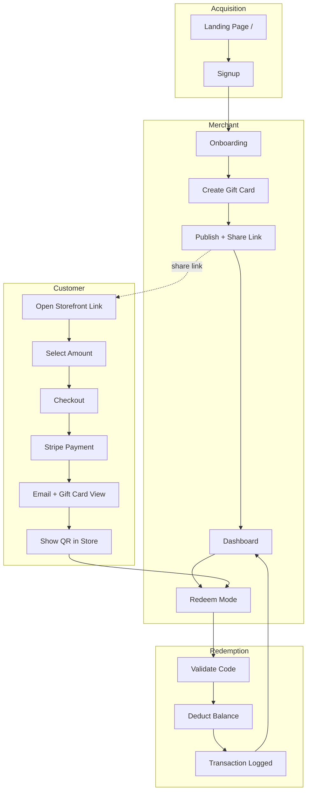
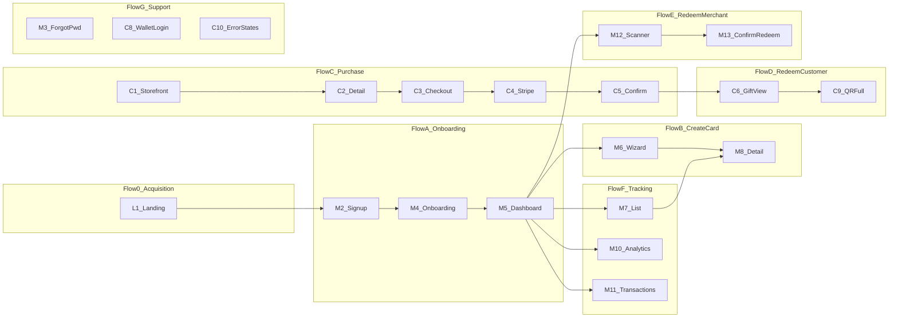
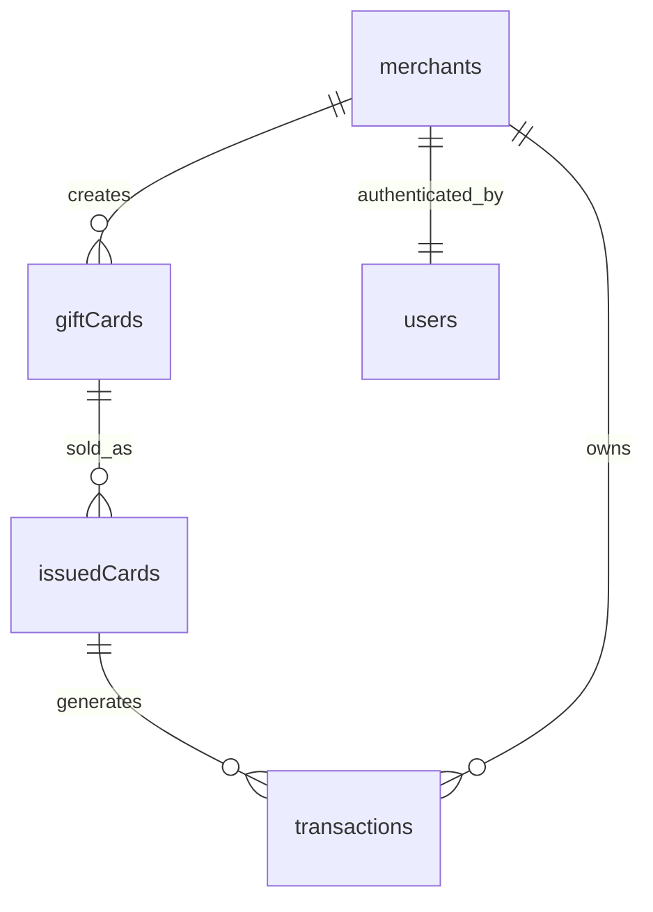

# Gifcards — Product Design Document (MVP)

> **Versión:** 1.0  
> **Rol:** Senior Product Designer  
> **Idioma default:** English (EN/ES)  
> **Enfoque:** Mobile first

---

## 1. Visión del producto

Gifcards es una plataforma B2B2C que permite a comercios en Ecuador crear, vender y gestionar gift cards digitales sin infraestructura técnica propia. El comercio configura su tarjeta en minutos; el cliente la compra online y la redime en tienda mediante QR o código.

**Usuarios primarios del MVP:** Merchant (dueño del comercio) y Cliente final. Staff y Admin de plataforma quedan fuera o en versión mínima del MVP.

**Punto de entrada público del MVP:** Landing page en `/` — canal principal de adquisición de comercios y presentación de la plataforma.

---

## 2. Flujos de usuario principales

### Flow 0 — Descubrimiento vía landing pública (Prospect → Merchant)

```
Tráfico orgánico / ads / referido → Landing pública (/) → Explora beneficios → CTA "Empezar gratis" → Sign up
```

| Paso | Acción | Resultado |
|------|--------|-----------|
| 1 | Usuario llega a gifcards.com | Ve propuesta de valor en hero (< 5 seg) |
| 2 | Scroll por secciones de ventajas y características | Entiende problema, solución y diferenciadores |
| 3 | Revisa "Cómo funciona" (3 pasos) | Comprende flujo completo sin registrarse |
| 4 | Tap CTA primario ("Start free" / "Empezar gratis") | Redirect a M2 Signup |
| 5 | (Opcional) Tap "Login" en nav | Redirect a M1 Login |

**Criterio de éxito:** ≥ 15% de visitantes hacen scroll hasta "Cómo funciona"; ≥ 5% hacen click en CTA signup.

---

### Flow A — Onboarding del comercio (Merchant)

```
Landing (/) → Sign up → Verificación email → Perfil del comercio (nombre, logo, colores) → Dashboard vacío → CTA "Crear primera gift card"
```

| Paso | Acción | Resultado |
|------|--------|-----------|
| 1 | Merchant descubre Gifcards (landing, referido, ads, búsqueda) | Entiende valor: gift cards en < 5 min |
| 2 | Crea cuenta (email + password o Google) | Cuenta Firebase Auth |
| 3 | Completa perfil del comercio | Branding base listo para gift cards |
| 4 | Llega al dashboard | Ve estado vacío con guía onboarding |

**Criterio de éxito:** Perfil completo y primera gift card publicada en una sesión.

---

### Flow B — Crear y publicar gift card (Merchant)

```
Dashboard → Crear gift card → Valor + diseño → Preview → Publicar → Copiar link / descargar QR
```

| Paso | Acción | Resultado |
|------|--------|-----------|
| 1 | Tap "Nueva gift card" | Formulario wizard (3 pasos max) |
| 2 | Define valor (fijo o rango min–max) | Precio configurado |
| 3 | Personaliza diseño (logo, colores, mensaje) | Preview en tiempo real |
| 4 | Publica | Gift card activa con URL única |
| 5 | Comparte link o QR | Listo para distribución |

**Criterio de éxito:** Tiempo de creación < 2 minutos (métrica del PRD).

---

### Flow C — Cliente compra gift card (Buyer)

```
Link del comercio → Tienda del comercio → Seleccionar gift card → Checkout → Pago (Stripe) → Confirmación → Email con gift card
```

| Paso | Acción | Resultado |
|------|--------|-----------|
| 1 | Abre link/QR del comercio | Ve storefront del merchant (1 comercio) |
| 2 | Elige monto (fijo o dentro del rango) | Gift card en carrito |
| 3 | Ingresa email (+ nombre opcional del destinatario) | Datos de entrega |
| 4 | Paga con Stripe | Transacción registrada |
| 5 | Recibe confirmación + email (Beely) | Link a wallet / QR visible |

**Variante — Regalo:** Comprador indica email del destinatario; destinatario recibe la tarjeta.

**Criterio de éxito:** Compra completada sin crear cuenta obligatoria (guest checkout).

---

### Flow D — Cliente consulta y usa gift card (Redeemer)

```
Email / link → Wallet o vista de tarjeta → Muestra QR/código en tienda → Staff/Merchant valida → Saldo actualizado
```

| Paso | Acción | Resultado |
|------|--------|-----------|
| 1 | Abre link desde email o wallet | Ve saldo, estado, diseño |
| 2 | En tienda, muestra QR o código alfanumérico | Pantalla fullscreen QR |
| 3 | Staff escanea o ingresa código | Validación en tiempo real |
| 4 | Confirma monto a descontar | Redención parcial o total |
| 5 | Cliente ve saldo actualizado | Historial de transacción visible |

**Criterio de éxito:** Redención en < 30 segundos desde presentación del QR.

---

### Flow E — Redención en tienda (Staff / Merchant)

```
Login staff → Scanner QR o input manual → Validación → Monto → Confirmar → Recibo
```

| Paso | Acción | Resultado |
|------|--------|-----------|
| 1 | Staff abre app web de redención | Modo scanner activo |
| 2 | Escanea QR o ingresa código | Sistema valida unicidad y saldo |
| 3 | Ingresa monto a redimir | Preview de saldo restante |
| 4 | Confirma | Transacción registrada, tarjeta actualizada |
| 5 | Muestra confirmación | Opcional: imprimir/compartir recibo |

**Nota MVP:** Staff puede ser el mismo merchant logueado en modo "Redeem" sin app separada.

---

### Flow F — Tracking del comercio (Merchant)

```
Dashboard → Métricas resumidas → Lista gift cards → Detalle (ventas + redenciones) → Historial transacciones
```

| Paso | Acción | Resultado |
|------|--------|-----------|
| 1 | Abre dashboard | KPIs: ventas, redenciones, saldo pendiente |
| 2 | Filtra por gift card o fecha | Datos accionables |
| 3 | Entra a detalle de una tarjeta | Lista de compras y redenciones |
| 4 | Revisa transacción individual | Auditoría completa |

---

### Flow G — Recuperación y soporte (transversal)

```
Olvidé contraseña → Reset email | Gift card perdida → Buscar por email | Error de pago → Retry checkout
```

Incluido en MVP de forma mínima (reset password, reenvío de email de gift card).

---

## 3. Mapa de pantallas — MVP completo

### 3.0 Landing pública (Web, mobile first)

| # | Pantalla / Sección | Descripción |
|---|-------------------|-------------|
| L1 | **Landing page (`/`)** | Página pública de marketing — adquisición de comercios |
| L1a | **Nav** | Logo, links ancla (Features, How it works, FAQ), Login, CTA Signup, toggle EN/ES |
| L1b | **Hero** | Headline, subheadline, CTA primario + secundario, mockup de gift card animado |
| L1c | **Social proof bar** | Logos placeholder / "Trusted by local businesses in Ecuador" |
| L1d | **Problem → Solution** | Dolor del comercio (sin infra digital) vs solución Gifcards |
| L1e | **Ventajas clave (benefits grid)** | 4–6 cards con icono: ingresos anticipados, retención, sin fricción técnica, etc. |
| L1f | **Características — Para comercios** | Crear en < 5 min, branding, QR/link, dashboard, redención, tracking |
| L1g | **Características — Para clientes** | Compra online, email/link, wallet, QR en tienda, saldo parcial |
| L1h | **Cómo funciona** | 3 pasos visuales: Crear → Vender → Redimir |
| L1i | **Demo / preview interactivo** | GIF o carousel: wizard de creación + storefront + QR |
| L1j | **Métricas de impacto** | Stats: "< 2 min setup", "100% digital", "Real-time tracking" |
| L1k | **FAQ** | 5–8 preguntas: precios, pagos, redención, seguridad, soporte |
| L1l | **CTA final** | Banner full-width: "Create your first gift card today" → Signup |
| L1m | **Footer** | Links legales (Términos, Privacidad), contacto, redes, idioma |

**Contenido de ventajas a destacar en landing (copy deck MVP):**

| Beneficio | Mensaje clave |
|-----------|---------------|
| Velocidad | Crea y publica gift cards en menos de 5 minutos, sin código |
| Ingresos anticipados | Vende antes de prestar el servicio; mejora flujo de caja |
| Retención | Trae clientes de vuelta; la gift card es un recordatorio de tu marca |
| Cero fricción técnica | Diseñado para comercios no digitales; mobile first |
| Distribución multicanal | Link, QR descargable y entrega por email |
| Control total | Dashboard con ventas, redenciones y saldo pendiente en tiempo real |
| Redención simple | QR o código manual; saldo parcial soportado |
| Seguridad | Códigos únicos, validación server-side, pagos seguros vía Stripe |
| White-label | Tu logo, tus colores; el cliente ve tu marca, no la nuestra |
| Escalable | Infraestructura cloud lista para crecer contigo |

**Total Landing MVP:** 1 página (`L1`) con 12 secciones ancla (single scroll). No requiere auth.

---

### 3.1 Merchant App (Web, mobile first)

| # | Pantalla | Descripción |
|---|----------|-------------|
| M1 | **Login** | Email/password, Google OAuth, link a signup |
| M2 | **Signup** | Registro merchant, términos |
| M3 | **Forgot password** | Reset vía email |
| M4 | **Onboarding — Perfil comercio** | Nombre, slug/URL, logo, colores primarios |
| M5 | **Dashboard** | KPIs, lista reciente, CTA crear gift card, empty state |
| M6 | **Crear gift card — Wizard** | Paso 1: valor · Paso 2: diseño · Paso 3: preview + publicar |
| M7 | **Lista de gift cards** | Cards con estado (activa/pausada), ventas, acciones |
| M8 | **Detalle gift card** | Config, link compartible, QR descargable, métricas, transacciones |
| M9 | **Editar gift card** | Mismos campos que crear; no editar códigos ya emitidos |
| M10 | **Analytics (básico)** | Gráfico ventas vs redenciones, periodo selectable |
| M11 | **Transacciones** | Tabla filtrable: compras + redenciones |
| M12 | **Modo redención** | Scanner QR + input manual (merchant como staff) |
| M13 | **Confirmación redención** | Monto, saldo restante, confirmar/cancelar |
| M14 | **Settings — Cuenta** | Email, password, idioma EN/ES |
| M15 | **Settings — Comercio** | Branding, slug, datos de contacto |
| M16 | **Settings — Pagos** | Conectar Stripe Connect / estado conexión |

**Total Merchant MVP:** 16 pantallas (algunas comparten layout/wizard).

---

### 3.2 Customer Interface (Web, mobile first)

| # | Pantalla | Descripción |
|---|----------|-------------|
| C1 | **Storefront del comercio** | Branding merchant, gift cards disponibles, CTA comprar |
| C2 | **Detalle gift card (pre-compra)** | Preview diseño, selector de monto, comprar |
| C3 | **Checkout** | Email comprador, destinatario opcional, mensaje regalo, resumen |
| C4 | **Pago (Stripe)** | Embedded checkout / redirect Stripe |
| C5 | **Confirmación de compra** | Éxito, resumen, link a ver tarjeta |
| C6 | **Vista gift card (pública por token)** | Diseño, saldo, QR, código, historial uso |
| C7 | **Wallet — Mis tarjetas** | Lista por email (magic link login, sin password) |
| C8 | **Wallet — Login** | Ingresar email → magic link |
| C9 | **QR fullscreen** | Modo presentación en tienda |
| C10 | **Error / expirada / agotada** | Estados terminales de la tarjeta |

**Total Customer MVP:** 10 pantallas.

---

### 3.3 Staff / Redemption (MVP integrado en Merchant)

| # | Pantalla | Descripción |
|---|----------|-------------|
| S1 | **Scanner** | Cámara + fallback input manual |
| S2 | **Resultado validación** | Válida / inválida / sin saldo / expirada |
| S3 | **Confirmar redención** | Monto, notas, confirmar |

**Nota:** S1–S3 se implementan como M12–M13 en MVP. App staff dedicada = post-MVP.

---

### 3.4 Platform Admin (fuera de MVP)

No incluido en MVP. Operaciones manuales vía Firebase/console hasta escala.

---

## 4. MVP vs Features futuras

### ✅ MVP (Release 1)

| Área | Incluido |
|------|----------|
| **Auth** | Merchant signup/login, customer magic link wallet |
| **Gift cards** | Valor fijo + rango variable, diseño básico (logo, colores, mensaje) |
| **Distribución** | Link único + QR descargable + email (Beely) |
| **Pagos** | Stripe (tarjeta) |
| **Redención** | QR + código manual, saldo parcial, registro transacciones |
| **Dashboard** | KPIs básicos, lista transacciones, detalle por gift card |
| **i18n** | EN default + ES |
| **Mobile** | Responsive, mobile first |
| **Seguridad** | Códigos únicos, validación server-side, rate limiting básico |
| **Landing pública** | Página marketing en `/` con ventajas, características, FAQ, CTAs signup/login, EN/ES |

### 🔜 Post-MVP (Release 2+)

| Feature | Prioridad | Razón de diferir |
|---------|-----------|------------------|
| Staff app dedicada (roles separados) | P2 | Merchant puede redimir en MVP |
| WhatsApp delivery | P2 | Email suficiente para validar |
| Campañas (Navidad, promos) | P2 | Gift cards individuales cubren caso base |
| Marketplace multi-comercio | P3 | MVP = storefront por merchant; landing promociona plataforma, no directorio |
| Landing — pricing page dedicada | P2 | MVP usa CTA "Start free"; pricing detallado post-validación |
| Landing — blog / SEO content | P3 | Landing estática suficiente para launch |
| Landing — testimonios reales | P2 | MVP usa social proof placeholder hasta primeros merchants |
| Exportación CSV/Excel | P2 | Dashboard con filtros primero |
| Expiración configurable | P2 | Opcional en PRD |
| Anti-fraude avanzado (ML, velocity) | P3 | Reglas básicas en MVP |
| Admin panel plataforma | P2 | Manual ops al inicio |
| Pagos alternativos (efectivo, transferencia) | P3 | Stripe valida modelo |
| AI (Gemini) — copy diseño, sugerencias | P3 | Nice-to-have |
| Amplitude dashboards avanzados | P2 | Eventos básicos en MVP |
| Notificaciones push | P3 | Email primero |
| Gift card física / impresión | P3 | Digital first |
| HIPAA compliance profunda | Revisar | Gift cards no son PHI; reclasificar requisito |
| Programa referidos / afiliados | P4 | Growth post-PMF |

---

## 5. Priorización de pantallas

Escala: **P0** = bloqueante MVP · **P1** = crítico UX · **P2** = importante pero puede ser v1.1 · **P3** = post-MVP

### P0 — Sin esto no hay producto

| Pantalla | Rol | Justificación |
|----------|-----|---------------|
| L1 Landing pública | Prospect / Merchant | Canal de adquisición; explica valor antes del signup |
| M1 Login / M2 Signup | Merchant | Acceso al sistema |
| M4 Onboarding perfil | Merchant | Branding necesario para gift cards |
| M6 Crear gift card | Merchant | Core value prop |
| M5 Dashboard (mínimo) | Merchant | Hub post-creación |
| C1 Storefront | Customer | Punto de compra |
| C3 Checkout | Customer | Captura datos + orden |
| C4 Pago Stripe | Customer | Monetización |
| C5 Confirmación | Customer | Cierre loop compra |
| C6 Vista gift card | Customer | Entrega del producto digital |
| M12–M13 Redención | Merchant/Staff | Cierra loop de valor |
| S2 Validación | Staff | Gate de redención |

### P1 — MVP completo y usable

| Pantalla | Rol | Justificación |
|----------|-----|---------------|
| M7 Lista gift cards | Merchant | Gestión multi-producto |
| M8 Detalle gift card | Merchant | Link, QR, métricas |
| M11 Transacciones | Merchant | Tracking PRD |
| C2 Detalle pre-compra | Customer | Selector monto variable |
| C9 QR fullscreen | Customer | Experiencia en tienda |
| C10 Estados error | Customer | Confianza y claridad |
| M3 Forgot password | Merchant | Recuperación estándar |
| M14–M15 Settings | Merchant | Cuenta e idioma |

### P2 — MVP pulido / v1.1 inmediato post-launch

| Pantalla | Rol | Justificación |
|----------|-----|---------------|
| M9 Editar gift card | Merchant | Iteración sin recrear |
| M10 Analytics básico | Merchant | Métrica de éxito PRD |
| C7–C8 Wallet | Customer | Retención, re-visita |
| M16 Settings pagos | Merchant | Onboarding Stripe |
| M4 empty states | Merchant | Onboarding guiado |

### P3 — Post-MVP

| Pantalla | Rol |
|----------|-----|
| Staff app standalone | Staff |
| Admin panel | Platform |
| Marketplace discovery | Customer |
| Campañas manager | Merchant |
| Export / reportes | Merchant |

---

## 6. Arquitectura de información (MVP)

```
Gifcards
├── Public
│   └── /                         → Landing (L1): hero, features, FAQ, CTAs
│
├── Merchant (auth required)
│   ├── Dashboard
│   ├── Gift Cards
│   │   ├── Create (wizard)
│   │   ├── List
│   │   └── Detail / Edit
│   ├── Redeem (scanner)
│   ├── Transactions
│   └── Settings
│       ├── Account
│       ├── Business
│       └── Payments
│
├── Customer (mostly public)
│   ├── /:merchantSlug          → Storefront
│   ├── /:merchantSlug/:cardId  → Product detail
│   ├── /checkout               → Checkout + Stripe
│   ├── /gift/:token            → Gift card view + QR
│   └── /wallet                 → Magic link + my cards
│
└── Shared
    ├── Login / Signup / Reset
    └── 404 / Error states
```

---

## 7. Flujos críticos — Diagrama



---

## 8. Principios de diseño (MVP)

1. **Mobile first:** Thumb-friendly CTAs, QR siempre a un tap.
2. **Landing = conversión:** Hero claro en 5 seg, un CTA primario repetido 3 veces (hero, mid-page, footer).
3. **Time-to-first-gift-card < 5 min:** Wizard corto, defaults inteligentes, preview instantáneo.
4. **Guest checkout:** No forzar cuenta al comprador; wallet opcional vía magic link.
5. **Confianza:** Estados claros (activa, parcial, agotada), recibos visibles.
6. **Branding dual:** Landing promociona Gifcards; storefront y gift card son white-label del merchant.
7. **i18n desde día 1:** Copy en EN/ES; detección por browser con toggle manual en nav.
8. **Accesibilidad:** Contraste en QR view, tamaños táctiles ≥ 44px, labels en forms, anclas navegables por teclado.

---

## 9. Design Direction

Dirección visual base para la plataforma Gifcards (landing y merchant app). El storefront y las gift cards de cada comercio usan los colores del merchant (white-label); esta paleta aplica a la UI de la plataforma.

### Color Palette

| Color | Hex |
|-------|-----|
| Primary | 🟦 #111827 |
| Secondary | 🟪 #4F46E5 |
| Accent | 🟩 #10B981 |
| Background | ⬜ #FFFFFF |
| Surface | ⚪ #F9FAFB |
| Border | 🔘 #E5E7EB |
| Text Secondary | ⚫ #6B7280 |

---

## 10. Estados y edge cases (por pantalla clave)

### C6 — Vista gift card

| Estado | UI |
|--------|-----|
| Activa | Saldo, QR, historial |
| Parcialmente usada | Saldo restante destacado |
| Agotada | Badge "Redeemed", QR oculto |
| Expirada (v1.1) | Mensaje + contacto merchant |
| Inválida / fraude | Error genérico, no revelar motivo |

### M12 — Redención

| Resultado | UI |
|-----------|-----|
| Válida | Formulario monto |
| Código no existe | Toast error |
| Sin saldo | Mostrar $0, bloquear |
| Ya procesada (idempotencia) | Mostrar transacción previa |

---

## 11. Métricas de diseño alineadas al PRD

| Métrica PRD | Pantalla / evento Amplitude |
|-------------|----------------------------|
| Adquisición landing | Funnel: `landing_view` → `landing_cta_click` → `signup_started` |
| Scroll engagement | `landing_section_view` (hero, features, how_it_works, faq) |
| 80% completan sesión | Funnel: signup → onboarding → first gift card published |
| Generación < 2 min | `gift_card_create_started` → `gift_card_published` |
| Retención semanal > 40% | `merchant_dashboard_view` D7 |
| Compra exitosa | Funnel: storefront → checkout → payment_success |
| Redención exitosa | `redemption_confirmed` |

---

## 12. Stack de diseño recomendado

| Capa | Herramienta sugerida |
|------|---------------------|
| Wireframes | Figma (low-fi, mobile 375px) |
| Design system | Tokens: color, spacing, typography (EN/ES) |
| Prototipo | Figma interactive: Flow B + C + D |
| Handoff | Figma Dev Mode + este documento |

---

## 13. Próximos pasos de diseño

1. **Semana 1:** Wireframes P0 — landing pública (L1) + pantallas merchant/customer core.
2. **Semana 2:** UI kit + landing visual design + storefront white-label + gift card template.
3. **Semana 3:** Prototipo clickable flujos 0, A–E + test landing con 5 prospects + 3 merchants.
4. **Semana 4:** Copy deck EN/ES (landing + app), specs de estados, handoff dev.

---

## 14. Screen Specifications — MVP

Especificación detallada por pantalla derivada de los flujos 0–G. Staff redemption (S1–S3) se implementa como M12–M13 en MVP.

### 14.0 Flow-to-Screen Matrix

| Flow | Nombre | Pantallas |
|------|--------|-----------|
| 0 | Descubrimiento vía landing | L1 |
| A | Onboarding del comercio | M2, M4, M5 |
| B | Crear y publicar gift card | M6, M8, M9 |
| C | Cliente compra gift card | C1, C2, C3, C4, C5 |
| D | Cliente consulta y usa gift card | C6, C9, C10 |
| E | Redención en tienda | M12, M13 |
| F | Tracking del comercio | M5, M7, M8, M10, M11 |
| G | Recuperación y soporte | M1, M3, C8, C10 |



**Inventario de rutas MVP:** Public 1 · Merchant 16 · Customer 10 · Shared 1 · **Total: 28**

---

### 14.1 Public — Landing (Flow 0)

#### L1 — Landing Page (`/`)

| Campo | Detalle |
|-------|---------|
| **Flujos** | 0 |
| **Prioridad** | P0 |
| **Propósito** | Adquirir comercios; comunicar valor, características y confianza antes del signup |

**Componentes clave:**
- Nav sticky: logo, links ancla (Features, How it works, FAQ), btn Login, CTA Signup, toggle EN/ES
- Hero: headline, subheadline, CTA primario, CTA secundario (scroll a demo), mockup animado de gift card
- Social proof bar: logos placeholder + tagline
- Problem/Solution: bloque contraste dos columnas
- Benefits grid: 4–6 cards con icono (velocidad, flujo de caja, retención, cero fricción, distribución, seguridad)
- Features — Comercios: lista con iconos
- Features — Clientes: lista con iconos
- Cómo funciona: visual 3 pasos (Create → Sell → Redeem)
- Demo producto: GIF/carousel (wizard, storefront, QR)
- Stats de impacto: 3 bloques
- FAQ: accordion, 5–8 items
- CTA final: banner full-width
- Footer: Términos, Privacidad, contacto, redes, idioma

**Datos necesarios:**
- Copy estático i18n (EN/ES JSON o CMS)
- URLs de assets: hero mockup, demo GIFs, icon set, logo
- FAQ: `{ question, answer }[]`
- Benefits/features: `{ icon, title, description }[]`
- URLs legales (Términos, Privacidad)
- Solo eventos analytics (sin datos de usuario/DB)

---

### 14.2 Merchant Auth & Onboarding (Flows A, G)

#### M1 — Login (`/login`)

| Campo | Detalle |
|-------|---------|
| **Flujos** | A, G |
| **Prioridad** | P0 |
| **Propósito** | Autenticar merchants existentes |

**Componentes clave:** Input email, input password, link "Forgot password", btn Login, Google OAuth, link a Signup, toggle idioma, error toast

**Datos necesarios:**
- Input: `email`, `password`
- Firebase Auth session token al éxito
- Redirect: dashboard si perfil completo, si no M4

---

#### M2 — Signup (`/signup`)

| Campo | Detalle |
|-------|---------|
| **Flujos** | 0, A |
| **Prioridad** | P0 |
| **Propósito** | Registrar nueva cuenta merchant |

**Componentes clave:** Nombre, email, password (+ confirm), checkbox términos, btn Signup, Google OAuth, link a Login, errores de validación

**Datos necesarios:**
- Input: `displayName`, `email`, `password`, `acceptedTermsAt`
- Crea: Firebase Auth user + doc vacío `merchants/{uid}`
- UTM/referrer desde landing (opcional, analytics)

---

#### M3 — Forgot Password (`/forgot-password`)

| Campo | Detalle |
|-------|---------|
| **Flujos** | G |
| **Prioridad** | P1 |
| **Propósito** | Disparar email de reset de contraseña |

**Componentes clave:** Input email, btn Send reset, mensaje de éxito, volver a Login

**Datos necesarios:**
- Input: `email`
- Firebase Auth `sendPasswordResetEmail` (sin lectura DB)

---

#### M4 — Onboarding — Business Profile (`/onboarding`)

| Campo | Detalle |
|-------|---------|
| **Flujos** | A |
| **Prioridad** | P0 |
| **Propósito** | Capturar branding del comercio requerido antes de la primera gift card |

**Componentes clave:** Input business name, preview slug/URL (`gifcards.com/:slug`), upload logo (crop), color pickers primario/secundario, contact email/phone (opcional), indicador de progreso, btn Save & Continue

**Datos necesarios:**
- Input: `businessName`, `slug`, `logoUrl`, `primaryColor`, `secondaryColor`, `contactEmail`, `contactPhone`
- Read: verificación disponibilidad slug
- Write: campos perfil `merchants/{merchantId}`, `onboardingCompleted: boolean`
- Colores default de paleta Gifcards si no se definen

---

### 14.3 Merchant Core (Flows B, F, E)

#### M5 — Dashboard (`/dashboard`)

| Campo | Detalle |
|-------|---------|
| **Flujos** | A, B, F |
| **Prioridad** | P0 |
| **Propósito** | Hub de KPIs, actividad reciente y acciones primarias |

**Componentes clave:** KPI cards (ventas totales, redenciones, saldo pendiente), CTA "Create gift card", lista transacciones recientes (5 items), quick links (Redeem, Gift cards, Transactions), empty state con checklist onboarding, nav bottom/side

**Datos necesarios:**
- Read `merchants/{merchantId}`: name, logo
- Agregados: `totalSales`, `totalRedemptions`, `outstandingBalance`, `period` (default 30d)
- Recent `transactions[]`: `{ id, type, amount, giftCardName, createdAt }`
- `giftCardsCount`, `hasPublishedCard` (para empty state)
- Auth: `merchantId`, session

---

#### M6 — Create Gift Card Wizard (`/gift-cards/new`)

| Campo | Detalle |
|-------|---------|
| **Flujos** | B |
| **Prioridad** | P0 |
| **Propósito** | Crear y publicar producto gift card en 3 pasos |

**Componentes clave:**
- Paso 1 — Valor: nombre, toggle tipo (fixed / variable range), monto o min/max, moneda (USD)
- Paso 2 — Diseño: mensaje, heredar logo/colores merchant, preview en vivo
- Paso 3 — Publicar: preview completo, btn publish, panel share post-publicación (copiar link, descargar QR)
- Stepper, Back/Next, confirmación discard

**Datos necesarios:**
- Input: `name`, `valueType` (fixed|variable), `fixedAmount` o `minAmount`/`maxAmount`, `message`, `designOverrides` (opcional)
- Read: branding default desde `merchants/{merchantId}`
- Write: `giftCards/{cardId}` con `status: active`, `publicUrl`, `qrCodeUrl`, `merchantId`, `createdAt`
- Generado: `cardId` único, URL storefront `/:slug/:cardId`

---

#### M7 — Gift Card List (`/gift-cards`)

| Campo | Detalle |
|-------|---------|
| **Flujos** | F |
| **Prioridad** | P1 |
| **Propósito** | Explorar y gestionar todos los productos gift card del merchant |

**Componentes clave:** Barra search/filter, filtro status (active/paused), grid/list (nombre, badge status, ventas, revenue), FAB o btn "New", empty state

**Datos necesarios:**
- Read `giftCards[]` where `merchantId`: `{ id, name, status, salesCount, totalRevenue, thumbnailPreview, createdAt }`
- Sort/filter params desde UI state

---

#### M8 — Gift Card Detail (`/gift-cards/:cardId`)

| Campo | Detalle |
|-------|---------|
| **Flujos** | B, F |
| **Prioridad** | P1 |
| **Propósito** | Gestionar producto individual: share, métricas, transacciones |

**Componentes clave:** Preview card, panel share (copiar link, descargar QR), toggle status (pause/resume), mini métricas (sold, redeemed, outstanding), tab transacciones, btn Edit, volver a lista

**Datos necesarios:**
- Read `giftCards/{cardId}`: config completa + `publicUrl`, `qrCodeUrl`, `status`
- Métricas: `soldCount`, `redeemedAmount`, `outstandingBalance`
- Read `transactions[]` filtradas por `giftCardId` (paginado)
- Auth: verificar ownership `merchantId`

---

#### M9 — Edit Gift Card (`/gift-cards/:cardId/edit`)

| Campo | Detalle |
|-------|---------|
| **Flujos** | B |
| **Prioridad** | P2 |
| **Propósito** | Actualizar config del producto sin afectar tarjetas ya emitidas |

**Componentes clave:** Mismos campos que M6 (Save en lugar de Publish), banner warning ("Changes won't affect issued cards"), preview

**Datos necesarios:**
- Read/write `giftCards/{cardId}`: solo campos editables (`name`, `message`, design, status)
- Inmutable: `valueType`, montos si ya hay ventas (o restringir edit si sales > 0)

---

#### M10 — Analytics (`/analytics`)

| Campo | Detalle |
|-------|---------|
| **Flujos** | F |
| **Prioridad** | P2 |
| **Propósito** | Visualizar ventas vs redenciones en el tiempo |

**Componentes clave:** Date range picker, gráfico line/bar (sales vs redemptions), totales resumen, btn export (disabled post-MVP)

**Datos necesarios:**
- Time-series: `{ date, salesAmount, redemptionAmount }[]` para rango seleccionado
- Agregados: `totalSales`, `totalRedemptions`, `netOutstanding`
- Filtro opcional por `giftCardId`

---

#### M11 — Transactions (`/transactions`)

| Campo | Detalle |
|-------|---------|
| **Flujos** | F |
| **Prioridad** | P1 |
| **Propósito** | Log auditable de compras y redenciones |

**Componentes clave:** Filter bar (tipo, date range, gift card), tabla searchable, row detail drawer, paginación

**Datos necesarios:**
- Read `transactions[]`: `{ id, type: purchase|redemption, amount, giftCardId, giftCardName, issuedCardId?, customerEmail?, code?, createdAt, status }`
- Filtros desde query params

---

#### M12 — Redemption Mode (`/redeem`)

| Campo | Detalle |
|-------|---------|
| **Flujos** | E (S1, S2) |
| **Prioridad** | P0 |
| **Propósito** | Escanear o ingresar código para iniciar redención |

**Componentes clave:** Scanner QR cámara, input manual código, btn Scan/Validate, panel resultado validación (valid/invalid/no balance), lista redenciones recientes

**Datos necesarios:**
- Input: `code` (desde QR decode o manual)
- Read `issuedCards/{code}` o lookup por token: `{ id, balance, status, giftCardId, merchantId, expiresAt? }`
- Read `giftCards/{giftCardId}`: name, merchant branding
- Response validación: `{ valid, balance, status, issuedCardId, errorCode? }`
- Auth: merchant session

---

#### M13 — Redemption Confirmation (`/redeem/confirm`)

| Campo | Detalle |
|-------|---------|
| **Flujos** | E (S3) |
| **Prioridad** | P0 |
| **Propósito** | Confirmar monto a descontar y completar redención |

**Componentes clave:** Resumen card (código enmascarado, balance actual), input monto (max = balance), notas opcionales, preview balance restante, btns Confirm/Cancel, vista recibo éxito

**Datos necesarios:**
- Input: `issuedCardId`, `amount`, `notes?`
- Read: `balance` actual, `giftCardName`, merchant info
- Write: `transactions/{id}` type redemption, update `issuedCards/{id}.balance`, `status` (partial|redeemed)
- Output: `{ transactionId, newBalance, redeemedAt }`

---

### 14.4 Merchant Settings (Flows A, G)

#### M14 — Settings — Account (`/settings/account`)

| Campo | Detalle |
|-------|---------|
| **Flujos** | G |
| **Prioridad** | P1 |
| **Propósito** | Gestionar credenciales y preferencias del merchant |

**Componentes clave:** Email display (read-only o change flow), form change password, selector idioma (EN/ES), btn logout, delete account (futuro)

**Datos necesarios:**
- Read Firebase Auth: `email`, `emailVerified`
- Input: `newPassword`, `language`
- Write: Auth profile, `merchants/{id}.preferredLanguage`

---

#### M15 — Settings — Business (`/settings/business`)

| Campo | Detalle |
|-------|---------|
| **Flujos** | A |
| **Prioridad** | P1 |
| **Propósito** | Actualizar perfil y branding del comercio |

**Componentes clave:** Mismos campos que M4, btn Save, warning cambio slug

**Datos necesarios:**
- Read/write `merchants/{merchantId}`: todos los campos perfil
- Validación unicidad slug al cambiar

---

#### M16 — Settings — Payments (`/settings/payments`)

| Campo | Detalle |
|-------|---------|
| **Flujos** | C (indirecto) |
| **Prioridad** | P2 |
| **Propósito** | Conectar cuenta Stripe para recibir pagos |

**Componentes clave:** Badge status Stripe Connect, btn Connect/Reconnect, resumen payout info, checklist requirements (si incompleto)

**Datos necesarios:**
- Read: `stripeAccountId`, `stripeOnboardingComplete`, `payoutsEnabled`, `requirementsDue[]`
- Stripe Connect OAuth link / account session URL
- Write: `merchants/{id}.stripeAccountId`, status onboarding vía webhooks

---

### 14.5 Customer — Purchase (Flow C)

#### C1 — Storefront (`/:merchantSlug`)

| Campo | Detalle |
|-------|---------|
| **Flujos** | C |
| **Prioridad** | P0 |
| **Propósito** | Tienda white-label con gift cards activas del merchant |

**Componentes clave:** Header merchant (logo, name, colors), grid productos gift card, tile (preview, price/range, btn Buy), footer contacto merchant, toggle idioma

**Datos necesarios:**
- Read `merchants` by `slug`: `{ businessName, logoUrl, primaryColor, secondaryColor, contactEmail }`
- Read active `giftCards[]`: `{ id, name, valueType, fixedAmount?, minAmount?, maxAmount?, previewImage?, message }`
- Sin auth requerida

---

#### C2 — Gift Card Product Detail (`/:merchantSlug/:cardId`)

| Campo | Detalle |
|-------|---------|
| **Flujos** | C |
| **Prioridad** | P1 |
| **Propósito** | Preview card y seleccionar monto antes del checkout |

**Componentes clave:** Preview card grande, selector monto (fixed display o range slider/input), descripción producto, btn Buy/Continue, footer trust merchant

**Datos necesarios:**
- Read `giftCards/{cardId}` + merchant branding
- Monto seleccionado (client state): `selectedAmount` validado contra min/max
- Pasar a checkout: `{ cardId, merchantId, amount }`

---

#### C3 — Checkout (`/checkout`)

| Campo | Detalle |
|-------|---------|
| **Flujos** | C |
| **Prioridad** | P0 |
| **Propósito** | Capturar info comprador/destinatario y resumen de orden (guest checkout) |

**Componentes clave:** Order summary (preview card, monto, merchant name), email comprador, toggle "Send as gift", recipient name/email, textarea mensaje regalo, btn Continue to payment, link términos

**Datos necesarios:**
- Input: `buyerEmail`, `isGift`, `recipientName?`, `recipientEmail?`, `giftMessage?`
- Session/cart: `{ giftCardId, merchantId, amount, merchantSlug }`
- Read gift card + merchant para summary
- Validación: formato email, monto aún válido

---

#### C4 — Payment — Stripe (`/checkout/pay`)

| Campo | Detalle |
|-------|---------|
| **Flujos** | C |
| **Prioridad** | P0 |
| **Propósito** | Procesar pago con tarjeta vía Stripe |

**Componentes clave:** Stripe Embedded Checkout o redirect, loading state, error retry, link cancel volver a C3

**Datos necesarios:**
- Crear Stripe Checkout Session: `{ amount, currency, merchantStripeAccountId, metadata: { giftCardId, buyerEmail, recipientEmail, ... } }`
- Input desde Stripe: `paymentIntentId`, `sessionId`
- Webhook crea `issuedCards/{id}` en `payment_intent.succeeded`

---

#### C5 — Purchase Confirmation (`/checkout/success`)

| Campo | Detalle |
|-------|---------|
| **Flujos** | C |
| **Prioridad** | P0 |
| **Propósito** | Confirmar compra exitosa y dirigir a la gift card |

**Componentes clave:** Icono éxito, order summary, btn "View your gift card", link "Send another", aviso email enviado

**Datos necesarios:**
- Read desde session/query: `issuedCardId` o `token`, `sessionId`
- Read `issuedCards/{id}`: `{ token, balance, giftCardPreview, deliveryEmail }`
- Status envío email (Beely): `emailSent: boolean`

---

### 14.6 Customer — Gift Card & Wallet (Flows C, D, G)

#### C6 — Gift Card View (`/gift/:token`)

| Campo | Detalle |
|-------|---------|
| **Flujos** | C, D |
| **Prioridad** | P0 |
| **Propósito** | Mostrar gift card comprada con balance, QR e historial de uso |

**Componentes clave:** Visual card branded, display balance, badge status, QR code, código alfanumérico (btn copy), btn "Show QR fullscreen", lista historial transacciones, footer info merchant

**Datos necesarios:**
- Read by `token`: `issuedCards/{id}` — `{ balance, initialAmount, status, code, qrPayload, giftCardId, merchantId, createdAt }`
- Read `giftCards/{giftCardId}`: design/message
- Read `merchants/{merchantId}`: branding
- Read `redemptionHistory[]`: `{ amount, redeemedAt, remainingBalance }`
- Sin auth (token es capability URL); rate-limit lookups

---

#### C7 — Wallet — My Cards (`/wallet`)

| Campo | Detalle |
|-------|---------|
| **Flujos** | D, G |
| **Prioridad** | P2 |
| **Propósito** | Listar gift cards asociadas al email del usuario |

**Componentes clave:** Lista cards (logo merchant, balance, status), tap abre C6, empty state, logout/clear session

**Datos necesarios:**
- Read `issuedCards[]` where `ownerEmail` = email autenticado
- Auth: magic link session (email verified)
- Cada item: `{ token, merchantName, balance, status, previewThumbnail }`

---

#### C8 — Wallet Login (`/wallet/login`)

| Campo | Detalle |
|-------|---------|
| **Flujos** | G |
| **Prioridad** | P2 |
| **Propósito** | Acceso passwordless al wallet vía magic link email |

**Componentes clave:** Input email, btn Send magic link, estado check-your-email, resend link

**Datos necesarios:**
- Input: `email`
- Firebase Auth magic link o custom token email
- Redirect a C7 al verificar

---

#### C9 — QR Fullscreen (`/gift/:token/qr`)

| Campo | Detalle |
|-------|---------|
| **Flujos** | D |
| **Prioridad** | P1 |
| **Propósito** | Modo presentación en tienda para escaneo por staff |

**Componentes clave:** QR fullscreen (alto contraste), código debajo QR, balance, hint brightness boost, swipe down para salir

**Datos necesarios:**
- Igual que C6: `qrPayload`, `code`, `balance`, `status`
- Bloquear display si status = redeemed/expired/invalid

---

#### C10 — Terminal States (`/gift/:token` variants)

| Campo | Detalle |
|-------|---------|
| **Flujos** | D, G |
| **Prioridad** | P1 |
| **Propósito** | Mensaje claro cuando la tarjeta no puede usarse |

**Componentes clave:** Ilustración status, mensaje (redeemed / expired / invalid / payment failed), CTA contact merchant, btn retry (solo errores checkout)

**Datos necesarios:**
- Read status `issuedCards`: `redeemed | expired | invalid | payment_failed`
- Contact merchant desde `merchants/{merchantId}`
- Context error para payment retry: `{ sessionId, giftCardId }`

---

### 14.7 Shared

#### 404 / Global Error

| Campo | Detalle |
|-------|---------|
| **Flujos** | Todos |
| **Propósito** | Manejar rutas inexistentes y errores irrecuperables |

**Componentes clave:** Mensaje, link home/landing, contacto soporte

**Datos necesarios:** Solo copy estático

---

### 14.8 Core Data Entities (Firebase)

Entidades que cruzan múltiples pantallas:

| Entidad | Campos clave | Pantallas principales |
|---------|-------------|----------------------|
| `merchants` | id, slug, businessName, logoUrl, primaryColor, secondaryColor, stripeAccountId, onboardingCompleted, preferredLanguage, contactEmail, contactPhone | L1 (CTA), M4, M5, M15, M16, C1, C6 |
| `giftCards` | id, merchantId, name, valueType, fixedAmount, minAmount, maxAmount, message, designOverrides, status, publicUrl, qrCodeUrl, createdAt | M6–M9, M7, M8, C1, C2, C3 |
| `issuedCards` | id, token, code, giftCardId, merchantId, balance, initialAmount, status, ownerEmail, recipientEmail, qrPayload, createdAt | C5–C10, M12, M13 |
| `transactions` | id, type, amount, merchantId, giftCardId, issuedCardId, customerEmail, code, status, createdAt, notes | M5, M8, M11, M13, C6 |
| `users` (Firebase Auth) | uid, email, emailVerified, provider | M1–M3, M14, C8 |

**Relaciones:**



---

## Apéndice A — Inventario total de pantallas

| Prioridad | Count | Pantallas |
|-----------|-------|-----------|
| P0 | 12 | L1, M1, M2, M4, M5, M6, M12, M13, C1, C3, C4, C5, C6 |
| P1 | 9 | M7, M8, M11, C2, C9, C10, M3, M14, M15 |
| P2 | 5 | M9, M10, C7, C8, M16 |
| P3 | — | Staff app, Admin, Marketplace, Campañas, Pricing page, Blog |

**MVP screen count:** ~28 pantallas/vistas (con layouts compartidos ~19 unique frames en Figma; landing = 1 frame scrollable con 12 secciones). Ver **Sección 14** para specs detalladas por pantalla.

---

## Apéndice B — Nota sobre HIPAA

El PRD menciona HIPAA compliance. Las gift cards de retail **no manejan información de salud protegida (PHI)**. Se recomienda reclasificar el requisito como **PCI-DSS** (pagos vía Stripe) y buenas prácticas de seguridad de datos personales (email, transacciones). Confirmar con legal antes de invertir en controles HIPAA.
